  

### 
I'm KMohZaid, a developer + cyber... 👨‍💻 who likes Python + JavaScript 🚀🤖

- 🔭 I’m currently working on [None || null ](#) 🙃

- 📚 I’m currently learning Programming languages **&& Cybersecurity stuff :computer::performing_arts::shield:**

- ❓ Ask me about anything that I know 😆

- ⚡ Fun fact: I use tabs over spaces

 

## Connect with me

  
  
  
  
  
  

 

## 📉 GitHub Stats 🌟

  

    
    
    
  

 

## Trophy 🏆

  

## Metrics ⚡️

 <table>
   <tr>
     <td rowspan=2>  </td>
     <td> 
	      
     </td>
   </tr>
   <tr>
	   <td>
       <!--  -->
       
     </td> 
   </tr>
   <tr>
	   <td rowspan="2"></td> 
   </tr>
   <tr>
	   <td></td> 
   </tr>
 </table>

